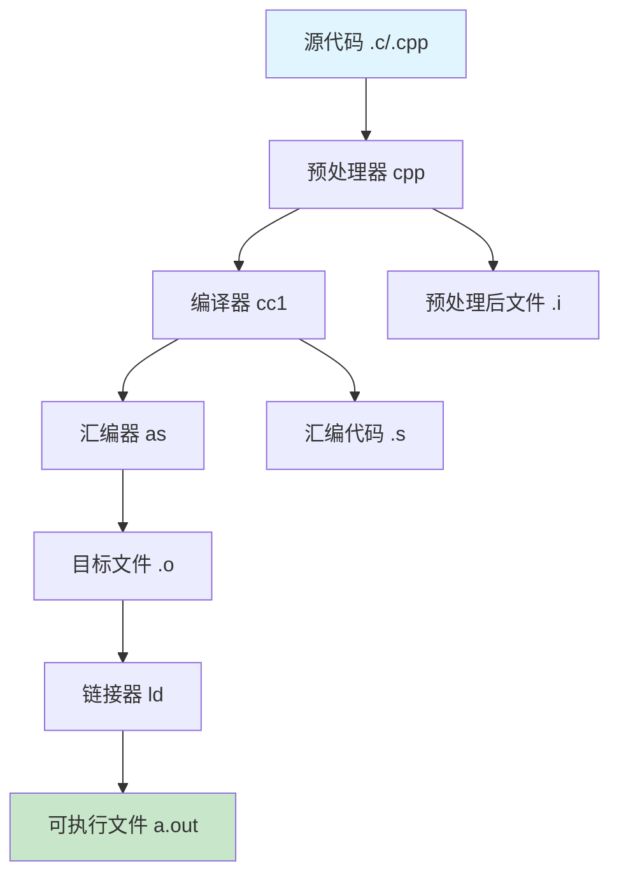
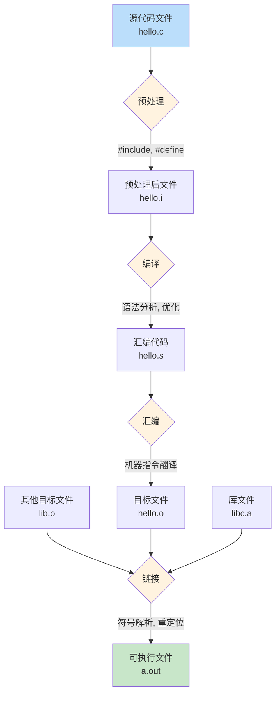

# GCC编译系统详解

## 📚 编译系统概述

GCC（GNU Compiler Collection）是一个功能强大的编译器套件，支持多种编程语言。在CSAPP第一章中，编译系统是理解程序如何从源代码转换为可执行文件的关键。

## 🔄 编译流程总览



## 🛠️ 四个主要阶段详解

### 1. 预处理阶段 (Preprocessing)

**工具**: `cpp` (C Preprocessor)
**输入**: `.c` 源文件
**输出**: `.i` 预处理后文件

**主要功能**:
- 处理所有以 `#` 开头的预处理指令
- 展开宏定义 (`#define`)
- 包含头文件 (`#include`)
- 条件编译 (`#if`, `#ifdef`, `#ifndef`)

**示例命令**:
```bash
# 只进行预处理
cpp hello.c hello.i
# 或者使用gcc的-E选项
gcc -E hello.c -o hello.i
```

**处理过程**:
```c
// 源代码 hello.c
#include <stdio.h>
#define PI 3.14159

int main() {
    printf("PI = %f\n", PI);
    return 0;
}
```

预处理后，`#include <stdio.h>` 会被替换为stdio.h文件的实际内容，`PI` 宏会被替换为 `3.14159`。

### 2. 编译阶段 (Compilation)

**工具**: `cc1` (C Compiler)
**输入**: `.i` 预处理后文件
**输出**: `.s` 汇编代码文件

**主要功能**:
- 语法和语义分析
- 生成中间代码
- 优化代码
- 生成目标平台的汇编代码

**示例命令**:
```bash
# 只进行编译
gcc -S hello.i -o hello.s
# 或者直接从.c文件开始
gcc -S hello.c -o hello.s
```

**生成的汇编代码示例**:
```assembly
    .section    __TEXT,__text,regular,pure_instructions
    .build_version macos, 11, 0
    .globl  _main
    .p2align    4, 0x90
_main:
    pushq   %rbp
    movq    %rsp, %rbp
    subq    $16, %rsp
    movl    $0, -4(%rbp)
    leaq    L_.str(%rip), %rdi
    movsd   LCPI0_0(%rip), %xmm0
    movb    $1, %al
    callq   _printf
    xorl    %eax, %eax
    addq    $16, %rsp
    popq    %rbp
    retq
```

### 3. 汇编阶段 (Assembly)

**工具**: `as` (Assembler)
**输入**: `.s` 汇编代码文件
**输出**: `.o` 目标文件

**主要功能**:
- 将汇编代码翻译为机器指令
- 生成可重定位的目标文件
- 创建符号表
- 处理地址引用

**示例命令**:
```bash
# 只进行汇编
as hello.s -o hello.o
# 或者使用gcc的-c选项
gcc -c hello.s -o hello.o
```

**目标文件特点**:
- 包含机器代码
- 包含符号表（函数名、变量名等）
- 包含重定位信息
- 还不能直接执行

### 4. 链接阶段 (Linking)

**工具**: `ld` (Linker)
**输入**: `.o` 目标文件 + 库文件
**输出**: 可执行文件

**主要功能**:
- 合并多个目标文件
- 解析符号引用
- 重定位地址
- 链接库函数

**示例命令**:
```bash
# 链接生成可执行文件
ld hello.o -lc -o hello
# 或者直接使用gcc
gcc hello.o -o hello
```

**链接过程详解**:
1. **符号解析**: 找到所有未定义的符号（如printf）
2. **重定位**: 为所有符号分配最终地址
3. **库链接**: 链接标准库和用户库

## 📊 详细流程图



## 🔧 GCC常用选项详解

### 分阶段编译选项
```bash
# 1. 只预处理
gcc -E source.c -o output.i

# 2. 预处理+编译
gcc -S source.c -o output.s

# 3. 预处理+编译+汇编
gcc -c source.c -o output.o

# 4. 完整编译（默认）
gcc source.c -o output
```

### 调试和优化选项
```bash
# 包含调试信息
gcc -g source.c -o output

# 优化级别
gcc -O0 source.c -o output  # 不优化
gcc -O1 source.c -o output  # 基本优化
gcc -O2 source.c -o output  # 标准优化
gcc -O3 source.c -o output  # 激进优化

# 显示所有警告
gcc -Wall source.c -o output
```

### 库和路径选项
```bash
# 指定头文件路径
gcc -I/path/to/include source.c -o output

# 指定库文件路径
gcc -L/path/to/libs source.c -o output

# 链接特定库
gcc source.c -lm -o output  # 数学库
gcc source.c -lpthread -o output  # 线程库
```

## 🎯 实际示例演示

### 完整编译过程
```bash
# 1. 创建测试文件
echo '#include <stdio.h>
int main() { printf("Hello CSAPP!\n"); return 0; }' > hello.c

# 2. 分步编译
gcc -E hello.c -o hello.i    # 预处理
gcc -S hello.i -o hello.s    # 编译
gcc -c hello.s -o hello.o    # 汇编
gcc hello.o -o hello         # 链接

# 3. 运行
./hello
```

### 查看中间文件
```bash
# 查看预处理结果
head -20 hello.i

# 查看汇编代码
cat hello.s

# 查看目标文件信息
nm hello.o

# 查看可执行文件信息
file hello
```

## 💡 理解编译系统的意义

### 对程序员的价值
1. **调试能力**: 理解编译错误和警告的来源
2. **优化意识**: 知道编译器如何优化代码
3. **性能分析**: 理解程序执行的开销
4. **跨平台开发**: 理解不同平台的差异

### 在CSAPP中的重要性
- 理解程序如何从文本变为可执行指令
- 为后续章节（汇编、链接、内存管理）打下基础
- 理解系统调用和库函数的关系

## 📝 自我测试题目

### 基础题
1. GCC编译的四个主要阶段是什么？每个阶段的输入输出是什么？
2. 预处理阶段主要处理哪些指令？
3. 目标文件和可执行文件的主要区别是什么？

### 应用题
1. 编写一个简单的C程序，使用分步编译方法生成可执行文件
2. 比较使用不同优化级别编译的程序大小和性能
3. 创建一个包含多个源文件的程序，理解链接过程

### 思考题
1. 为什么需要将编译过程分为多个阶段？
2. 链接器在程序执行中扮演什么角色？
3. 如何利用编译系统知识来优化程序性能？

---

**记住**: 理解GCC编译系统是掌握计算机系统底层原理的第一步，这个知识会在后续章节中反复用到！